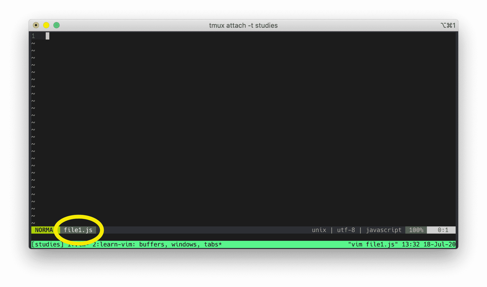
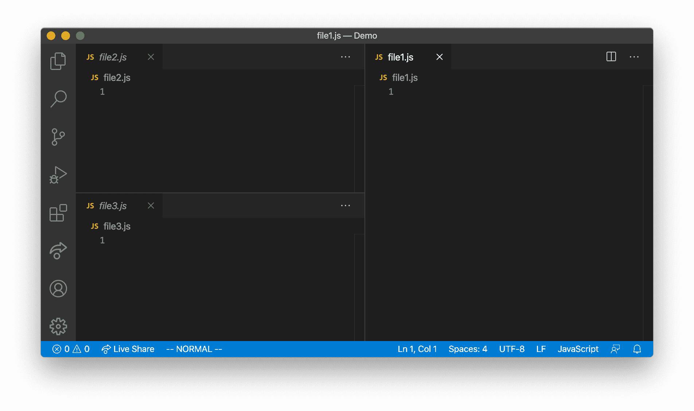
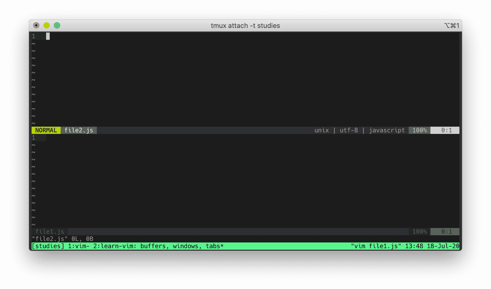
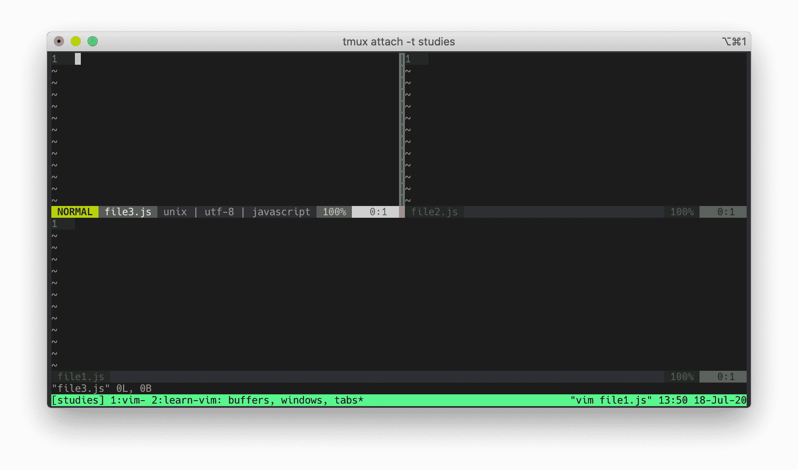
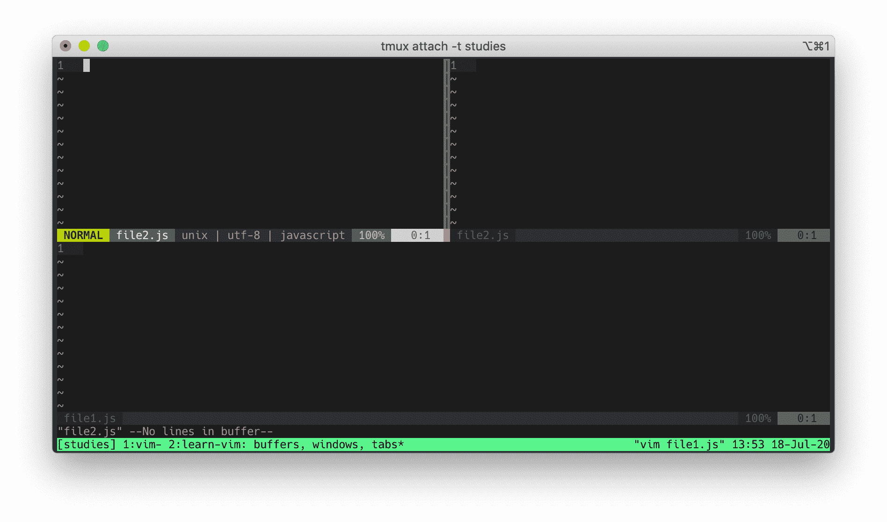
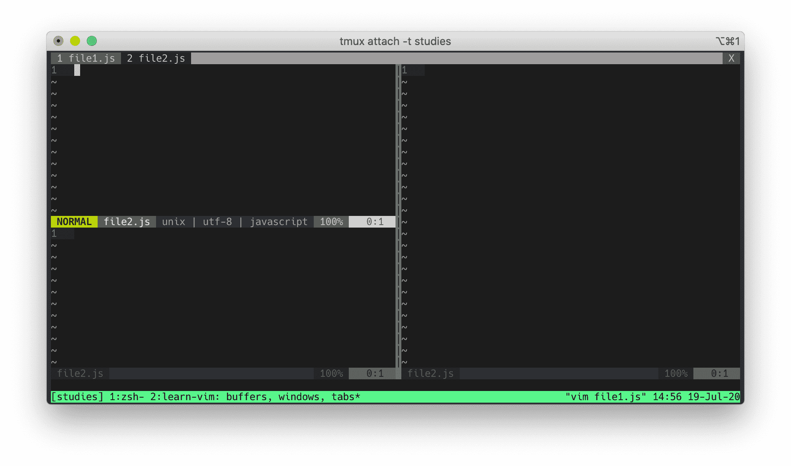
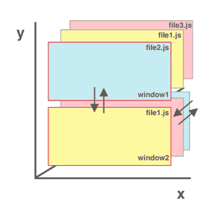

If you have used a modern text editor, you are probably familiar with windows and tabs. Vim has three abstractions instead of two: buffers, windows, and tabs.

In this chapter, I will explain how buffers, windows, and tabs work in Vim.

Before you start, make sure you have `set hidden` option in your `vimrc`. Without this, whenever you switch buffers, Vim will prompt you to save the file (you don't want that if you want to move quickly between buffers). For more information, check out `:h hidden`.

## Buffers

A buffer is an in-memory space where you can write and edit some text. When you are opening a new file in Vim its content will be bound to a new buffer:
  1. From within Vim, open a new buffer `:new` (create a new empty buffer)
  2. From your terminal, open a new file `file1.js` (create a new buffer with `file1.js` bound to it)

If your buffer isn't bound to a file yet but you want to save its content, you can save it with `:w </path/to/file>`.

```bash
vim file1.js
```



What you are seeing is `file1.js` *buffer*. Whenever we open a new file, Vim creates a new buffer.

Exit Vim. This time, open two new files:

```bash
vim file1.js file2.js
```


Vim displays `file1.js` buffer, but it actually creates two buffers: `file1.js` buffer and `file2.js` buffer. You can see all buffers with `:buffers` (alternatively, you can use `:ls` or `:files` too).


There are several ways you can traverse buffers:
1. `:bnext` in short you can use `:bn` to go to the next buffer (`:bprevious` or `:bp` in short, to go to the previous buffer).
2. `:buffer` + filename. Or instead `:buffer` `:b` in short. Vim can autocomplete filename with `tab`.
3. `:buffer` + `n`, where `n` is the buffer number. Or instead `:buffer` `:b` in short. For example, typing `:buffer 2` (or `:b 2`) will take you to buffer #2.
4. Jump to the older position in jump list with `Ctrl-o` and to the newer position with `Ctrl-i`. These are not buffer specific methods, but they can be used to jump between different buffers. I will talk more about jumps in Chapter 5.
5. Go to the previously edited buffer with `Ctrl-^`.


Once Vim creates a buffer, it will remain in your buffers list. To remove it, you can type `:bdelete`. It accepts either a buffer number (`:bdelete 3` to delete buffer #3) or a filename (`:bdelete` then use `tab` to autocomplete).

The hardest thing for me when learning about buffer was visualizing how it worked. One way to think of it is by imagining my buffers as a deck of cards. If I have 3 buffers, I  have a stack of 3 cards. If I see `file1.js` buffer displayed, then the `file1.js` card is at the top of the deck. I can't see `file2.js` and `file3.js` cards, but I know they are in the deck. If I switch to `file3.js` buffer, I am putting `file1.js` card in the deck and putting `file3.js` card to the top of the deck.

If you haven't used Vim before, this is a new concept. Take your time to understand it. When you're ready, let's move on to windows.

## Exiting Vim

If you have multiple buffers opened and have made some changes, you can close all of them and exit Vim with:

```
:qall
```

If you want to exit without saving your changes, just add `!` at the end:

```
:qall!
```

## Windows

A window is a viewport on a buffer. You can have multiple windows. Most text editors have the ability to display multiple windows. Below you see a VSCode with 3 windows.



Let's open `file1.js` from the terminal again:
```bash
vim file1.js
```


Earlier I said that you're looking at `file1.js` buffer. While that was correct, it was incomplete. You are looking at `file1.js` buffer displayed through **a window**. A window is what you are seeing a buffer through.

Don't quit Vim yet. Run:
```
:split file2.js
```



Now you are looking at two buffers through **two windows**. The top window displays `file2.js` buffer. The bottom window displays `file1.js` buffer.

By the way, if you want to navigate between windows, you can use these commands:

```
Ctrl-w h    Moves the cursor to the left window
Ctrl-w j    Moves the cursor to the window below
Ctrl-w k    Moves the cursor to the window upper
Ctrl-w l    Moves the cursor to the right window
```


Now run:
```
:vsplit file3.js
```




You are now seeing three windows displaying three buffers. The top left window displays `file3.js` buffer, the top right window displays `file2.js` buffer, and the bottom window displays `file1.js` buffer.

You can have multiple windows displaying the same buffer. While you're on the top left window, type:
```
:buffer file2.js
```



Now both top left and top right windows are displaying `file2.js` buffer. If you start typing on the top left, you'll see that the content on both top left and top right window are changing in real time.

To close the current window, you can run `Ctrl-w c` or type `:quit`. When you close a window, the buffer will still be there (again, to view your buffers, you can use `:buffers, :ls, :files`).

Here are some useful normal mode window commands:
```
Ctrl-w v    Opens a new vertical split
Ctrl-w s    Opens a new horizontal split
Ctrl-w c    Closes a window
Ctrl-w o    Makes the current window the only one on screen and closes other windows
```
And here is a list of useful window Ex commands:
```
:vsplit filename    Split window vertically
:split filename     Split window horizontally
:new filename       Create new window
```

For more, check out `:h window`. Take your time to understand them.

## Tabs

A tab is a collection of windows. Think of it like a layout for windows. In most modern text editors (and modern internet browsers), a tab means an open file/ page and when you close it, that file/page goes away. In Vim, a tab does not represent an open file. When you close a tab in Vim, you are not closing a file. Remember, Vim stores files in-memory via buffers. Closing a tab (or a window) does not make that file disappear from the buffers.

Let's see Vim tabs in action. Open `file1.js`:
```bash
vim file1.js
```

To open `file2.js` in a new tab:

```
:tabnew file2.js
```


You can also let Vim autocomplete the file you want to open in a *new tab* by pressing `tab` (no pun intended).


Below is a list of useful tab navigations:
```
:tabnew file.txt    open file.txt in a new tab
:tabclose           Close the current tab
:tabnext            Go to next tab
:tabprevious        Go to previous tab
:tablast            Go to last tab
:tabfirst           Go to first tab
```
You can also run `gt` to go to next tab page (you can go to previous tab with `gT`). You can pass count as argument to `gt`, where count is tab number. To go to the third tab, do `3gt`.

One advantage of having multiple tabs is you can have different window arrangements in different tabs. Maybe you want your first tab to have 3 vertical windows and second tab to have a mixed horizontal and vertical windows layout. Tab is the perfect tool for the job!




To start Vim with multiple tabs, you can do this from the terminal:
```bash
vim -p file1.js file2.js file3.js
```
## Moving In 3D

Moving between windows is like traveling two-dimensionally along X-Y axis in a Cartesian coordinate. You can move to the top, right, bottom, and left window with `Ctrl-w h/j/k/l`.


Moving between buffers is like traveling across the Z axis in a Cartesian coordinate. Imagine your buffer files are lined up across the Z axis. You can traverse the Z axis one buffer at a time with `:bnext` and `:bprevious`. You can jump to any coordinate in Z axis with `:buffer filename/buffernumber`.


You can move in *three-dimensional space* by combining window and buffer movements. You can move to the top, right, bottom, or left window (X-Y navigations) with window navigations. Since each window contains buffers, you can move forward and backward (Z navigations) with buffer movements.




## Using Buffers, Windows, and Tabs The Smart Way

You have learned how buffers, windows, and tabs work in Vim. To use them efficiently, you need to understand what they are designed for and apply them in your own workflow. Everyone has a different workflow, here is one example.

I would use buffers to open up all required files to get the current task done. This task may require opening seven or seven times seven buffer files, but it doesn't matter because Vim can handle many buffers before it starts slowing down. Plus having many buffers opened won't crowd my screen. I am only seeing one buffer (assuming I have only one window) at any time and I can quickly fly to any buffer I wish.

I would use multiple windows to view multiple buffers at once, usually when diffing files, comparing codes, or following a code flow. I usually don't keep more than three windows opened at the same time because my screen will get crowded. When I am done, I would close any extra windows. I prefer having as few opened windows as possible.

I would use a tab to handle client-side codes and a separate tab for back-end codes. Personally, I do not use tabs in my workflow. I use [tmux](https://github.com/tmux/tmux/wiki) windows as substitute for Vim tabs. My tmux workflow is similar to Vim tabs workflow. Instead of having multiple **Vim tabs** opened for each context, I would have multiple **tmux windows** (one tmux window for client-side codes and another window for back-end codes).

My workflow may look different than yours based on your editing style and that's fine. Experiment around to discover your own flow and find what works for you best.

