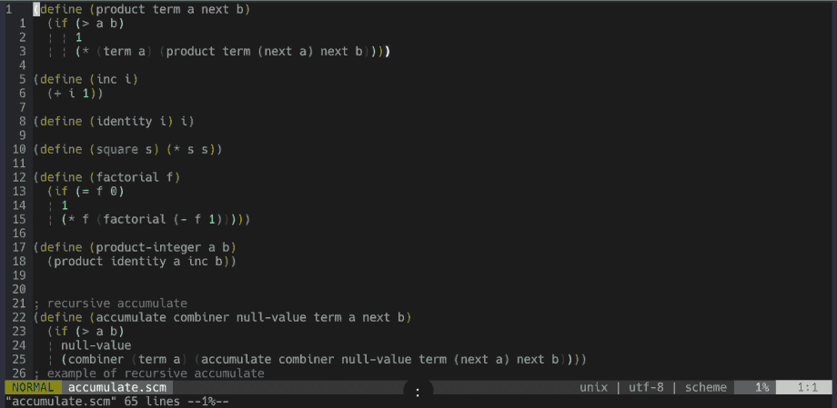
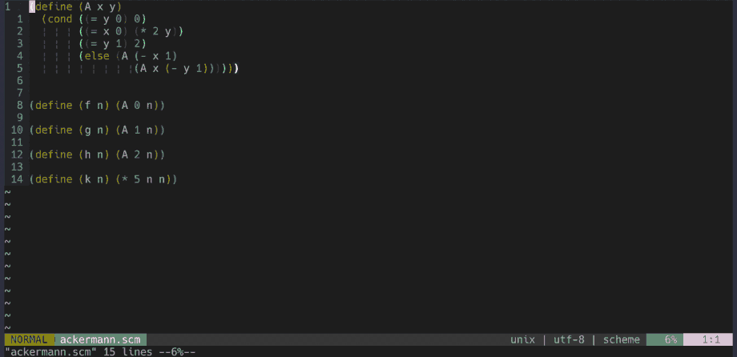

# Ch03. Searching Files

The goal of this chapter is to introduce you to how to search quickly in Vim. Being able to search quickly is a great way to jump-start your Vim productivity. When I figured out how to search files quickly, I made the switch to use Vim full-time.

This chapter is divided into two parts: how to search without plugins and how to search with [fzf.vim](https://github.com/junegunn/fzf.vim) plugin. Let's get started!

## Opening And Editing Files

To open a file in Vim, you can use `:edit`.

```
:edit file.txt
```

If `file.txt` exists, it opens the `file.txt` buffer. If `file.txt` doesn't exist, it creates a new buffer for `file.txt`.

Autocomplete with `<Tab>` works with `:edit`. For example, if your file is inside a [Rails](https://rubyonrails.org/) *a*pp *c*ontroller *u*sers controller directory `./app/controllers/users_controllers.rb`, you can use `<Tab>` to expand the terms quickly:

```
:edit a<Tab>c<Tab>u<Tab>
```

`:edit` accepts wildcards arguments. `*` matches any file in the current directory. If you are only looking for files with `.yml` extension in the current directory:

```
:edit *.yml<Tab>
```

Vim will give you a list of all `.yml` files in the current directory to choose from.

You can use `**` to search recursively. If you want to look for all `*.md` files in your project, but you are not sure in which directories, you can do this:

```
:edit **/*.md<Tab>
```

`:edit` can be used to run `netrw`, Vim's built-in file explorer. To do that, give `:edit` a directory argument instead of file:

```
:edit .
:edit test/unit/
```

## Searching Files With `:find`

You can find files with `:find`. For example:

```
:find package.json
:find app/controllers/users_controller.rb
```

Autocomplete also works with `:find`:

```
:find p<Tab>                " to find package.json
:find a<Tab>c<Tab>u<Tab>    " to find app/controllers/users_controller.rb
```

You may notice that `:find` looks like `:edit`. What's the difference?

The difference is that `:find` finds file in `path`, `:edit` doesn't. Let's learn a little bit about this `path`. Once you learn how to modify your paths, `:find` can become a powerful searching tool. To check what your paths are, do:

```
:set path?
```

By default, yours probably look like this:

```
path=.,/usr/include,,
```

- `.` means to search relative to the directory of the current file.
- `,` means to search in the current directory.
- `/usr/include` is the directory for C compilers header files.

The first two are important and the third one can be ignored for now. The take-home here is that you can modify your own paths. Let's assume this is your project structure:

```
app/
  assets/
  controllers/
    application_controller.rb
    comments_controller.rb
    users_controller.rb
    ...
```

If you want to go to `users_controller.rb` from the root directory, you have to go through several directories (and pressing a considerable amount of tabs). Often when working with a framework, you spend 90% of your time in a particular directory. In this situation, you only care about going to the `controllers/` directory with the least amount of keypress. The `path` setting can shorten that journey.

You need to add the `app/controllers/` to the current `path`. Here is how you can do it:

```
:set path+=app/controllers/
```

Now that your path is updated, when you type `:find u<Tab>`, Vim will now search inside `app/controllers/` directory for files starting with "u".

If you have a nested `controllers/` directory, like `app/controllers/account/users_controller.rb`, Vim won't find `users_controllers`. You need to instead add  `:set path+=app/controllers/**`  so autocomplete will find `users_controller.rb`. This is great! Now you can find the users controller with 1 press of tab instead of 3.

You might be thinking to add the entire project directories so when you press `tab`, Vim will search everywhere for that file, like this:

```
:set path+=$PWD/**
```

`$PWD` is the current working directory. If you try to add your entire project to `path` hoping to make all files to be reachable upon a `tab` press, although this may work for a small project, doing this will slow down your search significantly if you have a large number of files in your project. I recommend adding only the `path` of your most visited files / directories.

You can add the `set path+={your-path-here}` in your vimrc. Updating `path` takes only a few seconds and doing this will save you a lot of time.

## Searching In Files With `:grep`

If you need to find in files (find phrases in files), you can use grep. Vim has two ways of doing that:

- Internal grep (`:vim`. Yes, it is spelled `:vim`. It is short for `:vimgrep`).
- External grep (`:grep`).

Let's go through internal grep first. `:vim` has the following syntax:

```
:vim /pattern/ file
```

- `/pattern/` is a regex pattern of your search term.
- `file` is the file arguments. You can pass multiple arguments. Vim will search for the pattern inside the file arguments. Similar to `:find`, you can pass it `*` and `**` wildcards.

For example, to look for all occurrences of "breakfast" string inside all ruby files (`.rb`) inside `app/controllers/` directory:

```
:vim /breakfast/ app/controllers/**/*.rb
```

After running that, you will be redirected to the first result. Vim's `vim` search command uses `quickfix` operation. To see all search results, run `:copen`. This opens a `quickfix` window. Here are some useful quickfix commands to get you productive immediately:

```
:copen        Open the quickfix window
:cclose       Close the quickfix window
:cnext        Go to the next error
:cprevious    Go to the previous error
:colder       Go to the older error list
:cnewer       Go to the newer error list
```

To learn more about quickfix, check out `:h quickfix`.

You may notice that running internal grep (`:vim`) can get slow if you have a large number of matches. This is because Vim reads the searches into memory. Vim loads each matching files as if they are being edited. If Vim checks a large number of files, it will consume a large amount of memory.

Let's talk about external grep. By default, it uses `grep` terminal command. To search for "lunch" inside a ruby file inside `app/controllers/` directory, you can do this:

```
:grep "lunch" app/controllers/**/*.rb
```

Note that instead of using `/pattern/`, it follows the terminal grep syntax `"pattern"`. Just like `:vim`, `:grep` accepts `*` and `**` wildcards. It also displays all matches using `quickfix`.

Vim uses `grepprg` variable to determine which external program to run when running `:grep` so you don't have to always use the terminal `grep` command. Later I will show you how to change default the grep external program.

## Browsing Files With `netrw`

`netrw` is Vim's built-in file explorer. It is useful to see a project's structural hierarchy. To run `netrw`, you need these two settings in your `.vimrc`:

```
set nocp
filetype plugin on
```

Since `netrw` is a vast topic, I will only cover the basic usage, but it should be enough to get you started. You can start `netrw` when you launch Vim and passing it a directory instead of a file. For example:

```
vim .
vim src/client/
vim app/controllers/
```

To launch `netrw` from inside Vim, you can use the `:edit` command and pass it a directory instead of a filename:

```
:edit .
:edit src/client/
:edit app/controllers/
```

There are other ways to launch `netrw` window without passing a directory:

```
:Explore     Starts netrw on current file
:Sexplore    No kidding. Starts netrw on split top half of the screen
:Vexplore    Starts netrw on split left half of the screen
```

You can navigate `netrw` with Vim motions (motions will be covered in depth in a later chapter). If you need to create, delete, and rename file/directory, here is a list of useful `netrw` commands:

```
%    Create a new file
d    Create a new directory
R    Rename a file or directory
D    Delete a file or directory
```

`:h netrw` is very comprehensive. Check it out if you have time.

If you find `netrw` too bland and need more flavor, [vim-vinegar](https://github.com/tpope/vim-vinegar) is a good plugin to improve `netrw`. If you're looking for a different file explorer, [NERDTree](https://github.com/preservim/nerdtree) is a good alternative. Check them out!

## Fzf

Now that you've learned how to search files in Vim with built-in tools, let's learn how to do it with plugins.

One thing that modern text editors get right that Vim didn't is how easy it is to find files and to find in files using fuzzy search. In this second half of the chapter, I will show you how to use [fzf.vim](https://github.com/junegunn/fzf.vim) to make searching in Vim easy and powerful.

## Setup

First, make sure you have [fzf](https://github.com/junegunn/fzf) and [ripgrep](https://github.com/BurntSushi/ripgrep) downloaded. Follow the instruction on their github repo. The commands `fzf` and `rg` should now be available after successful installs.

Ripgrep is a search tool much like grep (hence the name). It is generally faster than grep and has many useful features. Fzf is a general-purpose command-line fuzzy finder. You can use it with any commands, including ripgrep. Together, they make a powerful search tool combination.

Fzf does not use ripgrep by default, so we need to tell fzf to use ripgrep with `FZF_DEFAULT_COMMAND` variable. In my `.zshrc` (`.bashrc` if you use bash), I have these:

```
if type rg &> /dev/null; then
  export FZF_DEFAULT_COMMAND='rg --files'
  export FZF_DEFAULT_OPTS='-m'
fi
```

Pay attention to `-m` in `FZF_DEFAULT_OPTS`. This option allows us to make multiple selections with `<Tab>` or `<Shift-Tab>`. You don't have to have this line to make fzf to work with Vim, but I think it is a useful option to have. It will come in handy when you want to perform search and replace in multiple files which I'll cover in just a little bit. The fzf command accepts many more flags, but I won't cover them here. To learn more, check out [fzf's repo](https://github.com/junegunn/fzf#usage) or `man fzf`. At minimum you should have `export FZF_DEFAULT_COMMAND='rg'`.

After installing fzf and ripgrep, let's set up the fzf plugin. I am using [vim-plug](https://github.com/junegunn/vim-plug) plugin manager in this example, but you can use any plugin managers.

Add these inside your `.vimrc` plugins. You need to use [fzf.vim](https://github.com/junegunn/fzf.vim) plugin (created by the same fzf author).

```
Plug 'junegunn/fzf.vim'
Plug 'junegunn/fzf', { 'do': { -> fzf#install() } }
```

For more info about this plugin, you can check out [fzf.vim repo](https://github.com/junegunn/fzf/blob/master/README-VIM.md).

## Fzf Syntax

To use fzf efficiently, you should learn some basic fzf syntax. Fortunately, the list is short:

- `^` is a prefix exact match. To search for a phrase starting with "welcome": `^welcome`.
- `$` is a suffix exact match. To search for a phrase ending with "my friends": `friends$`.
- `'` is an exact match. To search for the phrase "welcome my friends": `'welcome my friends`.
- `|` is an "or" match. To search for either "friends" or "foes": `friends | foes`.
- `!` is an inverse match. To search for phrase containing "welcome" and not "friends": `welcome !friends`

You can mix and match these options. For example, `^hello | ^welcome friends$` will search for the phrase starting with either "welcome" or "hello" and ending with "friends".

## Finding Files

To search for files inside Vim using fzf.vim plugin, you can use the `:Files` method. Run `:Files` from Vim and you will be prompted with fzf search prompt.

<p align="center">
  
</p>

Since you will be using this command frequently, it is good to have this mapped. I map mine to `Ctrl-f`. In my vimrc, I have this:

```
nnoremap <silent> <C-f> :Files<CR>
```

## Finding In Files

To search inside files, you can use the `:Rg` command.

<p align="center">
  
</p>

Again, since you will probably use this frequently, let's map it. I map mine to `<Leader>f`.

```
nnoremap <silent> <Leader>f :Rg<CR>
```

## Other Searches

Fzf.vim provides many other search commands. I won't go through each one of them here, but you can check them out [here](https://github.com/junegunn/fzf.vim#commands).

Here's what my fzf maps look like:

```
nnoremap <silent> <Leader>b :Buffers<CR>
nnoremap <silent> <C-f> :Files<CR>
nnoremap <silent> <Leader>f :Rg<CR>
nnoremap <silent> <Leader>/ :BLines<CR>
nnoremap <silent> <Leader>' :Marks<CR>
nnoremap <silent> <Leader>g :Commits<CR>
nnoremap <silent> <Leader>H :Helptags<CR>
nnoremap <silent> <Leader>hh :History<CR>
nnoremap <silent> <Leader>h: :History:<CR>
nnoremap <silent> <Leader>h/ :History/<CR>
```

## Replacing `grep` With `rg`

As mentioned earlier, Vim has two ways to search in files: `:vim` and `:grep`. `:grep` uses external search tool that you can reassign using the `grepprg` keyword. I will show you how to configure Vim to use ripgrep instead of terminal grep when running the `:grep` command.

Now let's setup `grepprg` so `:grep` uses ripgrep. Add this in your vimrc:

```
set grepprg=rg\ --vimgrep\ --smart-case\ --follow
```

Feel free to modify some of the options above! For more information what the options above mean, check out `man rg`.

After you updated `grepprg`, now when you run `:grep`, it runs `rg --vimgrep --smart-case --follow` instead of `grep`.  If you want to search for "donut" using ripgrep, you can now run a more succinct command `:grep "donut"` instead of `:grep "donut" . -R` 

Just like the old `:grep`, this new `:grep` also uses quickfix to display results.

You might wonder, "Well, this is nice but I never used `:grep` in Vim, plus can't I just use `:Rg` to find phrases in files? When will I ever need to use `:grep`?

That is a very good question. You may need to use `:grep` in Vim to do search and replace in multiple files, which I will cover next.

## Search And Replace In Multiple Files

Modern text editors like VSCode makes it very easy to search and replace a string across multiple files. In this section, I will show you two different methods to easily do that in Vim.

The first method is to replace *all* matching phrases in your project. You will need to use `:grep`. If you want to replace all instances of "pizza" with "donut", here's what you do:

```
:grep "pizza"
:cfdo %s/pizza/donut/g | update
```

Let's break down the commands:

1. `:grep pizza` uses ripgrep to search for all instances of "pizza" (by the way, this would still work even if you didn't reassign `grepprg` to use ripgrep. You would have to do `:grep "pizza" . -R` instead of `:grep "pizza"`).
2. `:cfdo` executes any command you pass to all files in your quickfix list. In this case, your command is the substitution command `%s/pizza/donut/g`. The pipe (`|`) is a chain operator. The `updat` command saves each file after substitution. I will cover substitute command in more depth in a later chapter.

The second method is to search and replace in select files. With this method, you can manually choose which files you want to perform select and replace on. Here is what you do:

1. Clear your buffers first. It is imperative that your buffer list contains only the files you need. You can either restart Vim or run `:%bd | e#` command (`%bd` deletes all the buffers and `e#` opens the file you were just on).
2. Run `:Files`.
3. Select all files you want to perform search-and-replace on. To select multiple files, use `<Tab>` / `<Shift-Tab>`. This is only possible if you have the multiple flag (`-m`) in `FZF_DEFAULT_OPTS`.
4. Run `:bufdo %s/pizza/donut/g | update`. The command `:bufdo %s/pizza/donut/g | update` looks similar to the earlier `:cfdo %s/pizza/donut/g | update` command. The difference is instead of substituting all quickfix entries (`:cfdo`), you are substituting all buffer entries (`:bufdo`).

## Learn Search The Smart Way

Searching is the bread-and-butter of text editing. Learning how to search well in Vim will improve your text editing workflow significantly.

Fzf.vim is a game-changer. I can't imagine using Vim without it. I think it is very important to have a good search tool when starting Vim. I've seen people struggling to transition to Vim because it is missing critical features modern text editors have, like an easy and powerful search feature. I hope this chapter will help you to make the transition to Vim easier. 

You also just saw Vim's extensibility in action - the ability to extend search functionality with a plugin and an external program. In the future, keep in mind of what other features you wish to extend in Vim. Chances are, someone has created a plugin or there is a program for it already. Next, you'll learn about a very important topic in Vim: Vim grammar.
