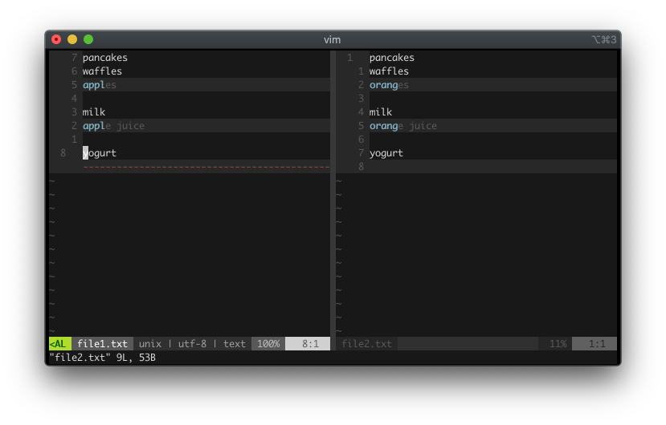
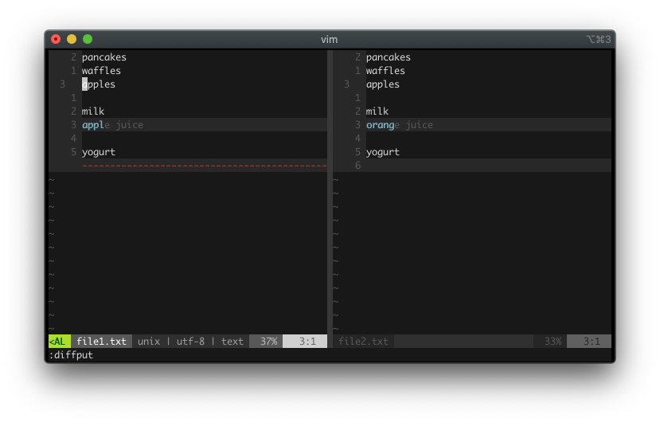
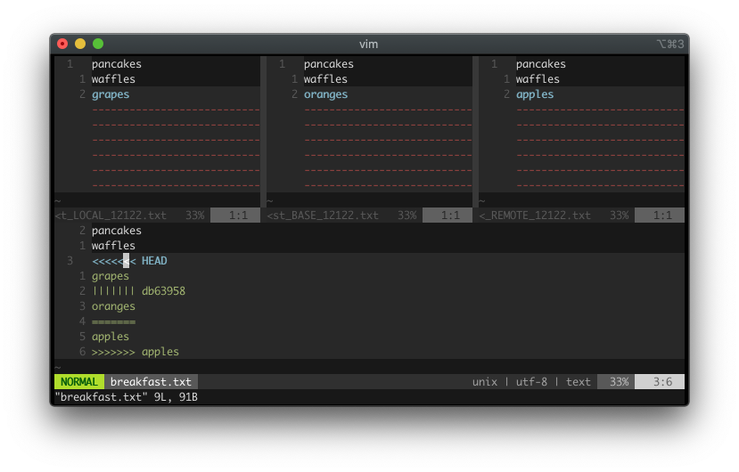
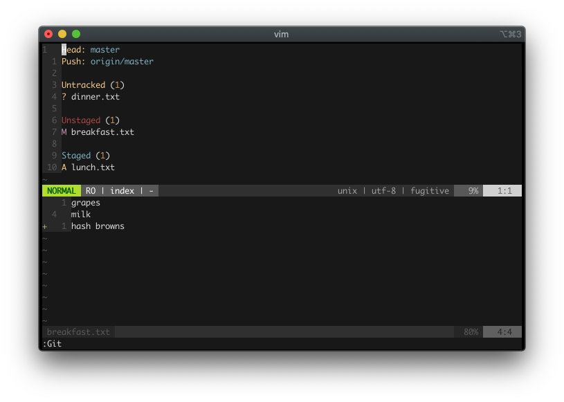
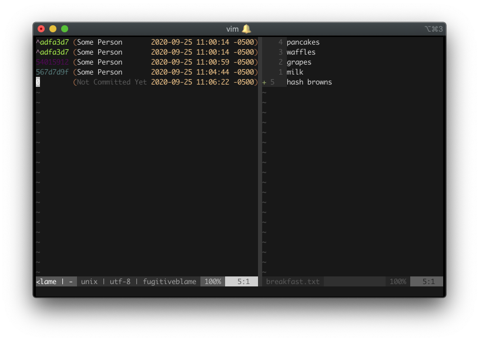
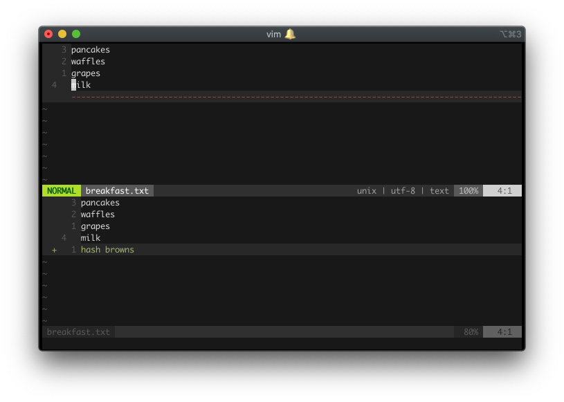
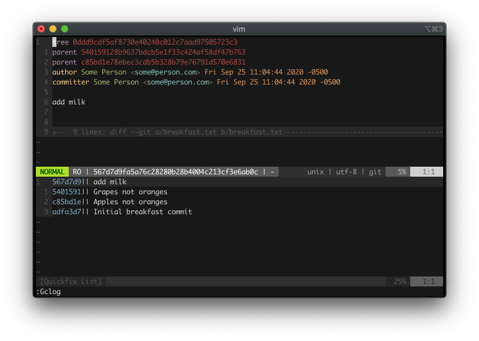

# Ch18. Git

Vim and git are two great tools for two different things. Git is a version control tool. Vim is a text editor.

In this chapter, you will learn different ways to integrate Vim and git together.

## Diffing

Recall in the previous chapter, you can run a `vimdiff` command to show the differences between multiple files.

Suppose you have two files, `file1.txt` and `file2.txt`. 

Inside `file1.txt`:

```
pancakes
waffles
apples

milk
apple juice

yogurt
```

Inside `file2.txt`:

```
pancakes
waffles
oranges

milk
orange juice

yogurt
```

To see the differences between both files, run:

```
vimdiff file1.txt file2.txt
```

Alternatively you could run:

```
vim -d file1.txt file2.txt
```

<p align="center">
  
</p>

`vimdiff` displays two buffers side-by-side. On the left is `file1.txt` and on the right is `file2.txt`. The first differences (apples and oranges) are highlighted on both lines.

Suppose you want to make the second buffer to have apples, not oranges. To transfer the content from your current position (you're currently on `file1.txt`) to `file2.txt`, first go to the next diff with `]c` (to jump to the previous diff window, use `[c`). The cursor should be on apples now. Run `:diffput`. Both files should now have apples.

<p align="center">
  
</p>

If you need to transfer the text from the other buffer (orange juice, `file2.txt`) to replace the text on the current buffer (apple juice, `file1.txt`), with your cursor still on `file1.txt` window, first go to the next diff with `]c`. Your cursor now should be on apple juice. Run `:diffget` to get the orange juice from another buffer to replace apple juice in our buffer.

`:diffput` *puts out* the text from the current buffer to another buffer. `:diffget` *gets* the text from another buffer to the current buffer.

If you have multiple buffers, you can run `:diffput fileN.txt` and `:diffget fileN.txt` to target the the fileN buffer.

## Vim As A Merge Tool

> "I love resolving merge conflicts!" - Nobody

I don't know anyone who likes resolving merge conflicts. However, they are inevitable. In this section, you will learn how to leverage Vim as a merge conflict resolution tool.

First, change the default merge tool to use `vimdiff` by running:

```
git config merge.tool vimdiff
git config merge.conflictstyle diff3
git config mergetool.prompt false
```

Alternatively, you can modify the `~/.gitconfig` directly (by default it should be in root, but yours might be in different place). The commands above should modify your gitconfig to look like the setting below, if you haven't run them already, you can also manually edit your gitconfig.

```
[core]
  editor = vim
[merge]
  tool = vimdiff
  conflictstyle = diff3
[difftool]
  prompt = false
```

Let's create a fake merge conflict to test this out. Create a directory `/food` and make it a git repository:

```
git init
```

Add a file, `breakfast.txt`. Inside:

```
pancakes
waffles
oranges
```

Add the file and commit it:

```
git add .
git commit -m "Initial breakfast commit"
```

Next, create a new branch and call it apples branch:

```
git checkout -b apples
```

Change the `breakfast.txt`:

```
pancakes
waffles
apples
```

Save the file, then add and commit the change:

```
git add .
git commit -m "Apples not oranges"
```

Great. Now you have oranges in the master branch and apples in the apples branch. Let's return to the master branch:

```
git checkout master
```

Inside `breakfast.txt`, you should see the base text, oranges. Let's change it to grapes because they are in season right now:

```
pancakes
waffles
grapes
```

Save, add, and commit:

```
git add .
git commit -m "Grapes not oranges"
```

Now you are ready to merge the apples branch into the master branch:

```
git merge apples
```

You should see an error:

```
Auto-merging breakfast.txt
CONFLICT (content): Merge conflict in breakfast.txt
Automatic merge failed; fix conflicts and then commit the result.
```

A conflict, great! Let's resolve the conflict using our newly-configured `mergetool`. Run:

```
git mergetool
```

<p align="center">
  
</p>

Vim displays four windows. Pay attention to the top three:

- `LOCAL` contains `grapes`. This is the change in "local", what you are merging into.
- `BASE` contains `oranges`. This is the common ancestor between `LOCAL` and `REMOTE` to compare how they diverge.
- `REMOTE` contains `apples`. This is what is being merged into.

At the bottom (the fourth window) you see:

```
pancakes
waffles
<<<<<<< HEAD
grapes
||||||| db63958
oranges
=======
apples
>>>>>>> apples
```

The fourth window contains the merge conflict texts. With this setup, it is easier to see what change each environment has. You can see the content from `LOCAL`, `BASE`, and `REMOTE` at the same time. 

Your cursor should be on the fourth windows, on the highlighted area. To get the change from `LOCAL` (grapes), run `:diffget LOCAL`. To get the change from `BASE` (oranges), run `:diffget BASE` and to get the change from `REMOTE` (apples), run `:diffget REMOTE`.

In this case, let's get the change from `LOCAL`. Run `:diffget LOCAL`. The fourth window will now have grapes. Save and exit all files (`:wqall`) when you are done. That wasn't bad, right?

If you notice, you also have a file `breakfast.txt.orig` now. Git creates a backup file in case things don't go well. If you don't want git to create a backup during a merge, run:

```
git config --global mergetool.keepBackup false
```

## Git Inside Vim

Vim does not have a native git feature built-in. One way to run git commands from Vim is to use the bang operator, `!`, in the command-line mode.

Any git command can be run with `!`:

```
:!git status
:!git commit
:!git diff
:!git push origin master
```

You can also use Vim's `%` (current buffer) or `#` (other buffer) conventions:

```
:!git add %         " git add current file
:!git checkout #    " git checkout the other file
```

One Vim trick you can use to add multiple files in different Vim window is to run:

```
:windo !git add %
```

Then make a commit:

```
:!git commit "Just git-added everything in my Vim window, cool"
```

The `windo` command is one of Vim's "do" commands, similar to `argdo` that you saw previously. `windo` executes the command on each window.

Alternatively, you can also use `bufdo !git add %` to git add all buffers or `argdo !git add %` to git add all the file arguments, depending on your workflow.

## Plugins

There are many Vim plugins for git support. Below is a list of some of the popular git-related plugins for Vim (there is probably more at the time you read this):

- [vim-gitgutter](https://github.com/airblade/vim-gitgutter)
- [vim-signify](https://github.com/mhinz/vim-signify)
- [vim-fugitive](https://github.com/tpope/vim-fugitive)
- [gv.vim](https://github.com/junegunn/gv.vim)
- [vimagit](https://github.com/jreybert/vimagit)
- [vim-twiggy](https://github.com/sodapopcan/vim-twiggy)
- [rhubarb](https://github.com/tpope/vim-rhubarb)

One of the most popular ones is vim-fugitive. For the remaining of the chapter, I will go over a several git workflow using this plugin.

## Vim-fugitive

The vim-fugitive plugin allows you to run the git CLI without leaving the Vim editor. You will find that some commands are better when executed from inside Vim.

To get started, install the vim-fugitive with a Vim plugin manager ([vim-plug](https://github.com/junegunn/vim-plug), [vundle](https://github.com/VundleVim/Vundle.vim), [dein.vim](https://github.com/Shougo/dein.vim), etc).

## Git Status

When you run the `:Git` command without any parameters, vim-fugitive displays a git summary window. It shows the untracked, unstaged, and staged file(s). While in this "`git status`" mode, you can do several things:
- `Ctrl-N` / `Ctrl-P` to go up or down the file list.
- `-` to stage or unstage the file name under the cursor.
- `s` to stage the file name under the cursor.
- `u` to unstage the file name under the cursor.
- `>` / `<` to display or hide an inline diff of the file name under the cursor.

<p align="center">
  
</p>

For more, check out `:h fugitive-staging-maps`.

## Git Blame

When you run the `:Git blame` command from the current file, vim-fugitive displays a split blame window. This can be useful to find the person responsible for writing that buggy line of code so you can yell at him / her (just kidding).

Some things you can do while in this `"git blame"` mode:
- `q` to close the blame window.
- `A` to resize the author column.
- `C` to resize the commit column.
- `D` to resize the date / time column.

For more, check out `:h :Git_blame`.

<p align="center">
  
</p>

## Gdiffsplit

When you run the `:Gdiffsplit` command, vim-fugitive runs a `vimdiff` of the current file's latest changes against the index or work tree. If you run `:Gdiffsplit <commit>`, vim-fugitive runs a `vimdiff` against that file inside `<commit>`.

<p align="center">
  
</p>

Because you are in a `vimdiff` mode, you can *get* or *put* the diff with `:diffput` and `:diffget`.

## Gwrite And Gread

When you run the `:Gwrite` command in a file after you make changes, vim-fugitive stages the changes. It is like running `git add <current-file>`.

When you run the `:Gread` command in a file after you make changes, vim-fugitive restores the file to the state prior to the changes. It is like running `git checkout <current-file>`. One advantage of running `:Gread` is the action is undo-able. If, after you run `:Gread`, you change your mind and want to keep the old change, you can just run undo (`u`) and Vim will undo the `:Gread` action. This would not have been possible if you had run `git checkout <current-file>` from the CLI.

## Gclog

When you run the `:Gclog` command, vim-fugitive displays the commit history. It is like running the `git log` command. Vim-fugitive uses Vim's quickfix to accomplish this, so you can use `:cnext` and `:cprevious` to traverse to the next or previous log information. You can open and close the log list with `:copen` and `:cclose`.

<p align="center">
  
</p>

While in this `"git log"` mode, you can do two things:
- View the tree.
- Visit the parent (the previous commit).

You can pass to `:Gclog` arguments just like the `git log` command. If your project has a long commit history and you only need to view the last three commits, you can run `:Gclog -3`. If you need to filter it based on the committer's date, you can run something like `:Gclog --after="January 1" --before="March 14"`.

## More Vim-Fugitive

These are only a few examples of what vim-fugitive can do. To learn more about vim-fugitive, check out `:h fugitive.txt`. Most of the popular git commands are probably optimized with vim-fugitive. You just have to look for them in the documentation.

If you are inside one of vim-fugitive's "special mode" (for example, inside `:Git` or `:Git blame` mode) and you want to learn what shortcuts are available, press `g?`. Vim-fugitive will display the appropriate `:help` window for the mode you are in. Neat!

## Learn Vim And Git The Smart Way

You may find vim-fugitive to be a good compliment to your workflow (or not). Regardless, I would strongly encourage you to check out all the plugins listed above. There are probably others I didn't list. Go try them out.

One obvious way to get better with Vim-git integration is to read more about git. Git, on its own, is a vast topic and I am only showing a fraction of it. With that, let's *git going* (pardon the pun) and talk about how to use Vim to compile your code!
