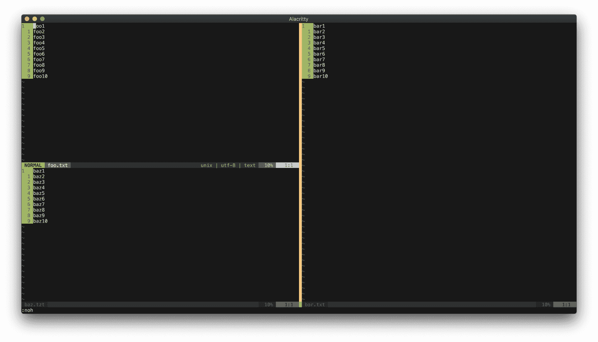

# Ch20. Views, Sessions, And Viminfo

After you worked on a project for a while, you may find the project to gradually take shape with its own settings, folds, buffers, layouts, etc. It's like decorating your apartment after living in it for a while. The problem is, when you close Vim, you lose those changes. Wouldn't it be nice if you can keep those changes so the next time you open Vim, it looks just like you had never left?

In this chapter, you will learn how use View, Session, and Viminfo to preserve a "snapshot" of your projects.

## View

A View is the smallest subset of the three (View, Session, Viminfo). It is a collection of settings for one window. If you spend a long time working on a window and you want to preserve the maps and folds, you can use a View.

Let's create a file called `foo.txt`:

```
foo1
foo2
foo3
foo4
foo5
foo6
foo7
foo8
foo9
foo10
```

In this file, create three changes:
1. On line 1, create a manual fold `zf4j` (fold the next 4 lines).
2. Change the `number` setting: `setlocal nonumber norelativenumber`. This will remove the number indicators on the left side of the window.
3. Create a local mapping to go down two lines each time you press `j` instead of one: `:nnoremap <buffer> j jj`.

Your file should look like this:

```
+-- 5 lines: foo1 -----
foo6
foo7
foo8
foo9
foo10
```

### Configuring View Attributes

Run:

```
:set viewoptions?
```

By default it should say (yours may look different depending on your vimrc):

```
viewoptions=folds,cursor,curdir
```

Let's configure `viewoptions`. The three attributes you want to preserve are the folds, the maps, and the local set options. If your setting looks like mine, you already have the `folds` option. You need to tell View to remember the `localoptions`. Run:

```
:set viewoptions+=localoptions
```

To learn what other options are available for `viewoptions`, check out `:h viewoptions`. Now if you run `:set viewoptions?`, you should see:

```
viewoptions=folds,cursor,curdir,localoptions
```

### Saving The View

With the `foo.txt` window properly folded and having `nonumber norelativenumber` options, let's save the View. Run:

```
:mkview
```

Vim creates a View file.

### View Files

You might wonder, "Where did Vim save this View file?" To see where Vim saves it, run:

```
:set viewdir?
```

In Unix based OS the default should say `~/.vim/view` (if you have a different OS, it might show a different path. Check out `:h viewdir` for more). If you are running a Unix based OS and want to change it to a different path, add this into your vimrc:

```
set viewdir=$HOME/else/where
```

### Loading The View File

Close the `foo.txt` if you haven't, then open `foo.txt` again. **You should see the original text without the changes.** That's expected. 

To restore the state, you need to load the View file. Run:

```
:loadview
```

Now you should see:

```
+-- 5 lines: foo1 -----
foo6
foo7
foo8
foo9
foo10
```

The folds, local settings, and local mappings are restored. If you notice, your cursor should also be on the line where you left it when you ran `:mkview`. As long as you have the `cursor` option, View also remembers your cursor position.

### Multiple Views

Vim lets you save 9 numbered Views (1-9).

Suppose you want to make an additional fold (say you want to fold the last two lines) with `:9,10 fold`. Let's save this as View 1. Run:

```
:mkview 1
```

If you want to make one more fold with `:6,7 fold` and save it as a different View, run:

```
:mkview 2
```

Close the file. When you open `foo.txt` and you want to load View 1, run:

```
:loadview 1
```

To load View 2, run:

```
:loadview 2
```

To load the original View, run:

```
:loadview
```

### Automating View Creation

One of the worst things that can happen is, after spending countless hours organizing a large file with folds, you accidentally close the window and lose all fold information. To prevent this, you might want to automatically create a View each time you close a buffer. Add this in your vimrc:

```
autocmd BufWinLeave *.txt mkview
```

Additionally, it might be nice to load View when you open a buffer:

```
autocmd BufWinEnter *.txt silent loadview
```

Now you don't have to worry about creating and loading View anymore when you are working with `txt` files. Keep in mind that over time, your `~/.vim/view` might start to accumulate View files. It's good to clean it up once every few months.

## Sessions

If a View saves the settings of a window, a Session saves the information of all windows (including the layout).

### Creating A New Session

Suppose you are working with these 3 files in a `foobarbaz` project:

Inside `foo.txt`:

```
foo1
foo2
foo3
foo4
foo5
foo6
foo7
foo8
foo9
foo10
```

Inside `bar.txt`:

```
bar1
bar2
bar3
bar4
bar5
bar6
bar7
bar8
bar9
bar10
```

Inside `baz.txt`:

```
baz1
baz2
baz3
baz4
baz5
baz6
baz7
baz8
baz9
baz10
```

Let's say that your windows layout look like the following (using strategically placed `split` and `vsplit`):



To preserve this look, you need to save the Session. Run:

```
:mksession
```

Unlike `mkview` where it saves to `~/.vim/view` by default, `mksession` saves a Session file (`Session.vim`) in the current directory. Check out the file if you're curious what's inside.

If you want to save the Session file somewhere else, you can pass an argument to `mksession`:

```
:mksession ~/some/where/else.vim
```

If you want to overwrite the existing Session file, call the command with a `!` (`:mksession! ~/some/where/else.vim`).

### Loading A Session

To load a Session, run:

```
:source Session.vim
```

Now Vim looks like just the way you left it! Alternatively, you can also load a Session file from the terminal:

```
vim -S Session.vim
```

### Configuring Session Attributes

You can configure the attributes Session saves. To see what is currently being saved, run:

```
:set sessionoptions?
```

Mine says:

```
blank,buffers,curdir,folds,help,tabpages,winsize,terminal
```

If you don't want to save `terminal` when you save a Session, remove it from the session options. Run:

```
:set sessionoptions-=terminal
```

If you want to add an `options` when you save a Session, run:

```
:set sessionoptions+=options
```

Here are some attributes that `sessionoptions` can store:
- `blank` stores empty windows
- `buffers` stores buffers
- `folds` stores folds
- `globals` stores global variables (must start with an uppercase letter and contain at least one lowercase letter)
- `options` stores options and mappings
- `resize` stores window lines and columns
- `winpos` stores window position
- `winsize` stores window sizes
- `tabpages` stores tabs
- `unix` stores files in Unix format

For the complete list check out `:h 'sessionoptions'`.

Session is a useful tool to preserve your project's external attributes. However, some internal attributes aren't saved by Session, like local marks, registers, histories, etc. To save them, you need to use Viminfo!

## Viminfo

If you notice, after yanking a word into register a and quitting Vim, the next time you open Vim you still that text stored in the register. This is actually a work of Viminfo. Without it, Vim won't remember the register after you close Vim.

If you use Vim 8 or higher, Vim enables Viminfo by default, so you may have been using Viminfo this whole time without knowing it!

You might ask: "What does Viminfo save? How does it differ from Session?"

To use Viminfo, first you need to have `+viminfo` feature available (`:version`). Viminfo stores:
- The command-line history.
- The search string history.
- The input-line history.
- Contents of non-empty registers.
- Marks for several files.
- File marks, pointing to locations in files.
- Last search / substitute pattern (for 'n' and '&').
- The buffer list.
- Global variables.

In general, Session stores the "external" attributes and Viminfo the "internal" attributes.

Unlike Session where you can have one Session file per project, you normally will use one Viminfo file per computer. Viminfo is project-agnostic.

The default Viminfo location for Unix is `$HOME/.viminfo` (`~/.viminfo`). If you use a different OS, your Viminfo location might be different. Check out `:h viminfo-file-name`. Each time you make "internal" changes, like yanking a text into a register, Vim automatically updates the Viminfo file.

*Make sure that you have `nocompatible` option set (`set nocompatible`), otherwise your Viminfo will not work.*

### Writing And Reading Viminfo

Although you will use only one Viminfo file, you can create multiple Viminfo files. To write a Viminfo file, use the `:wviminfo` command (`:wv` for short).

```
:wv ~/.viminfo_extra
```

To overwrite an existing Viminfo file, add a bang to the `wv` command:

```
:wv! ~/.viminfo_extra
```

By default Vim will read from `~/.viminfo` file. To read from a different Viminfo file, run `:rviminfo`, or `:rv` for short:

```
:rv ~/.viminfo_extra
```

To start Vim with a different Viminfo file from the terminal, use the `i` flag:

```
vim -i viminfo_extra
```

If you use Vim for different tasks, like coding and writing, you can create a Viminfo optimized for writing and another for coding.

```
vim -i viminfo_writing

vim -i viminfo_coding
```

### Starting Vim Without Viminfo

To start Vim without Viminfo, you can run from the terminal:

```
vim -i NONE
```

To make it permanent, you can add this in your vimrc file:

```
set viminfo="NONE"
```

### Configuring Viminfo Attributes

Similar to `viewoptions` and `sessionoptions`, you can instruct what attributes to save with the `viminfo` option. Run:

```
:set viminfo?
```

You will get:

```
!,'100,<50,s10,h
```

This looks cryptic. Let's break it down:
- `!` saves global variables that start with an uppercase letter and don't contain lowercase letters. Recall that `g:` indicates a global variable. For example, if at some point you wrote the assignment `let g:FOO = "foo"`, Viminfo will save the global variable `FOO`. However if you did `let g:Foo = "foo"`, Viminfo will not save this global variable because it contains lowercase letters. Without `!`, Vim won't safe those global variables.
- `'100` represents marks. In this case, Viminfo will save the local marks (a-z) of the last 100 files. Be aware that if you tell Viminfo to save too many files, Vim can start slowing down. 1000 is a good number to have.
- `<50` tells Viminfo how many maximum lines are saved for each registers (50 in this case). If I yank 100 lines of text into register a (`"ay99j`) and close Vim, the next time I open Vim and paste from register a (`"ap`), Vim will only paste 50 lines max. If you don't give maximum line number, *all* lines will be saved. If you give it 0, nothing will be saved.
- `s10` sets a size limit (in kb) for a register. In this case, any register greater than 10kb size will be excluded.
- `h` disables highlighting (from `hlsearch`) when Vim starts.

There are other options that you can pass. To learn more, check out `:h 'viminfo'`.

## Using Views, Sessions, And Viminfo The Smart Way

Vim has View, Session, and Viminfo to take different level of your Vim environment snapshots. For micro projects, use Views. For larger projects, use Sessions. You should take your time to check out all the options that View, Session, and Viminfo offers.

Create your own View, Session, and Viminfo for your own editing style. If you ever need to use Vim outside of your computer, you can just load your settings and you will immediately feel at home!
